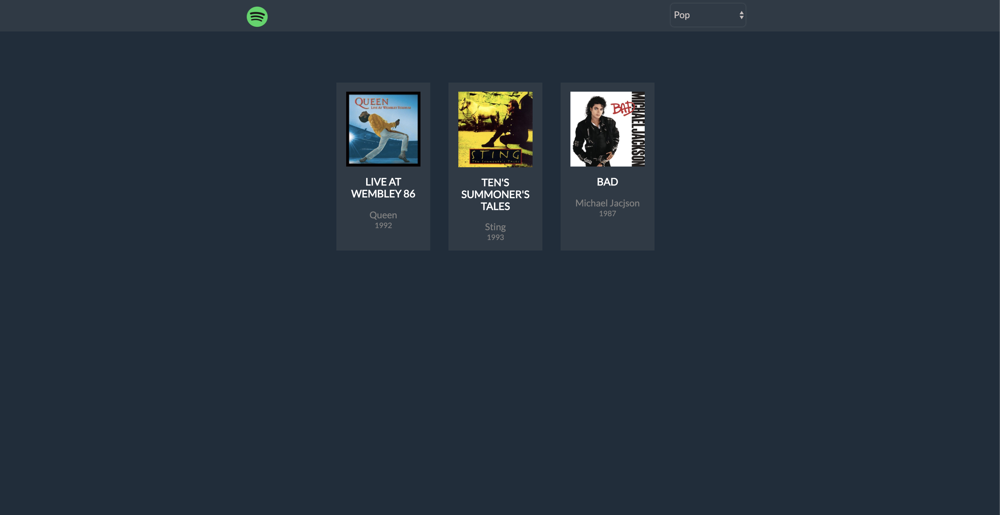

# 	Find SONG info with API ## 

> 
>
> ##### *:open_file_folder: File Name*:  js-jq-ajax-api-musica :open_file_folder:
>
> 

### :man_teacher: *BOOL TASK* 

Attraverso una chiamata ajax all’Api di boolean avremo a disposizione una decina di dischi musicali. 

Servendoci di handlebars stampiamo tutto a schermo.In questo momento non è importante la parte grafica.

___Bonus___: Creare una select con i seguenti generi: pop, rock, metal e jazz. In base a cosa scegliamo nella select vedremo i corrispondenti cd.*

#### :computer: Languages:

* HTML
* CSS
* JS
* jQuery
* Ajax

## :desktop_computer: Project Preview:

*Visit My Github Profile for more* __Projects__:man_technologist:

> https://github.com/AndreaDeMartino

